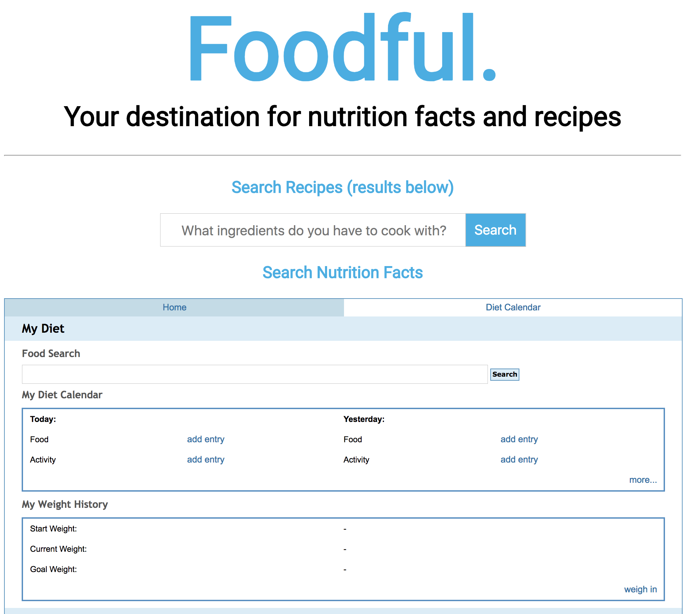

# Foodful
Your destination for nutrition facts and recipes.

# Link to live app
https://lamktom.github.io/Foodful/

# How to load unsafe scripts (if app not loading):
If the app is not loading, it may be that your browser is blocking the content, please follow these steps to get the app to load. 

This is what it it looks like when the browser is preventing the app from running: 

Look for this icon on your address bar and click it: 

Click "Load Unsafe Scripts" to load the entire Landing Page (see next section for screenshot): 

# Screenshots
Landing Page: 

Recipe Search Results: 

Nutrition Facts: 

# Summary
Users may enter ingredients that they would like to cook with to explore recipies and nutrition facts. When entering multiple ingredients for recipe search, separate with commas.

# Technologies Used 
HTML, CSS, JavaScript, jQuery, AJAX
